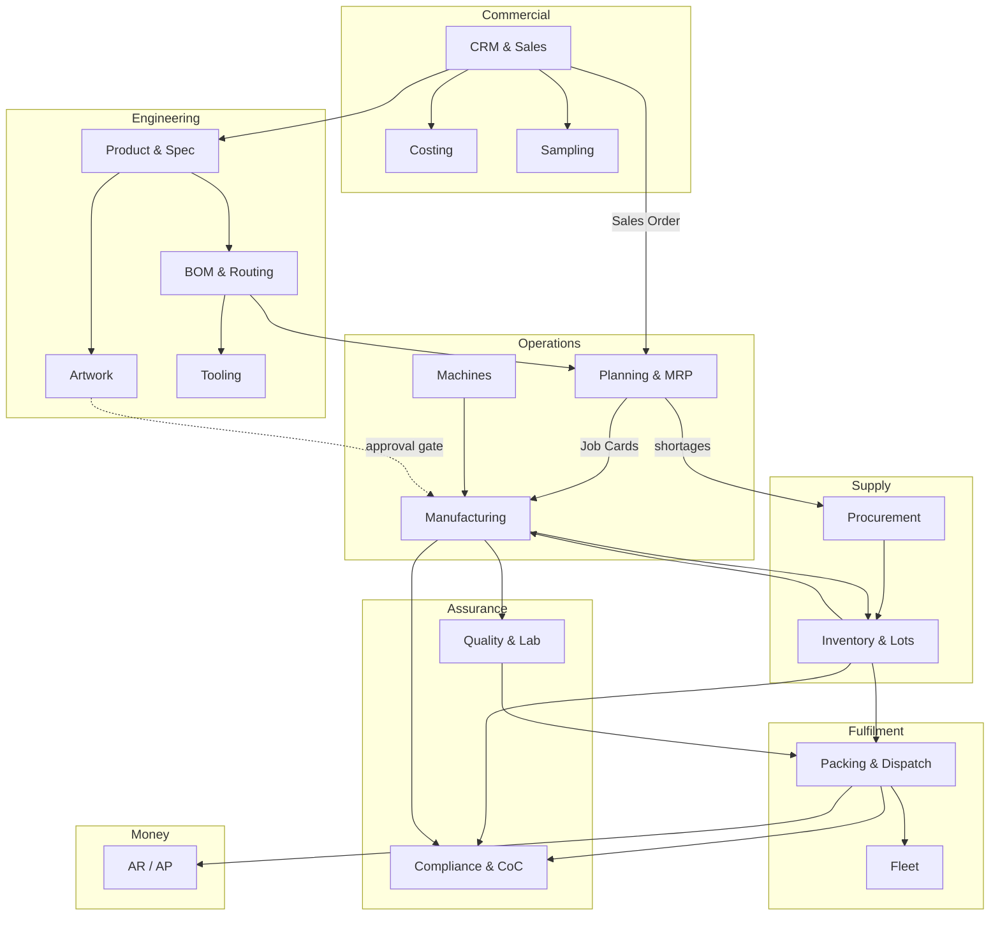
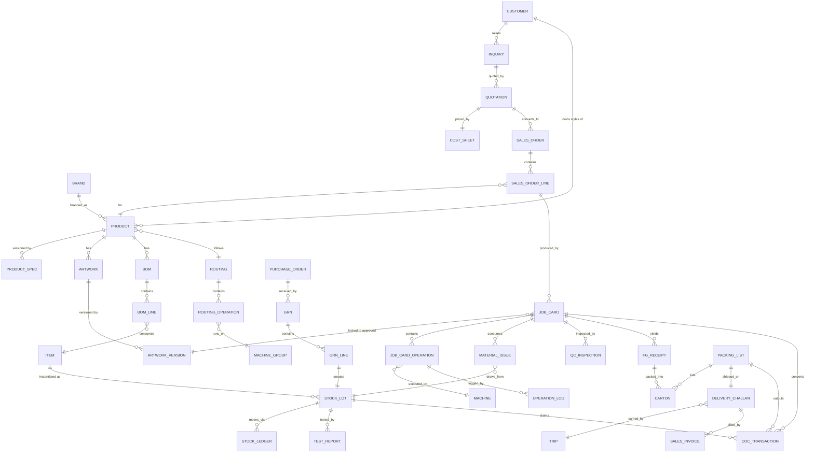
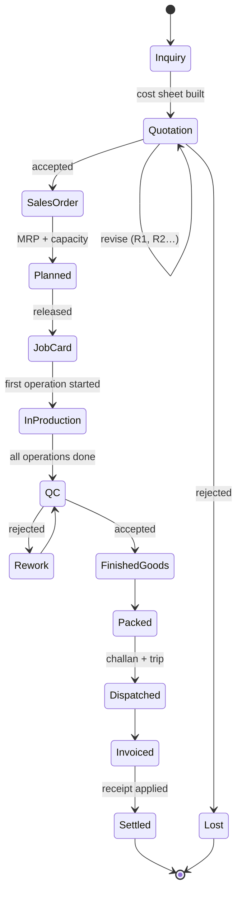

# 01 — Domain Model

Vocabulary is defined in [00-overview §7](00-overview.md#7-glossary). This document defines the bounded contexts, the aggregates inside them, and the invariants that must hold regardless of UI.

---

## 1. Bounded contexts

**Rule of thumb:** contexts communicate through documents (Sales Order, Job Card, GRN, Packing List), never by reaching into each other's tables. In a monolith this is enforced by module boundaries and service classes, not by network calls — see [08-architecture](08-architecture.md).

---

## 2. Core entity relationships

---

## 3. Aggregates and their invariants

An **aggregate** is a cluster of entities saved and validated as one unit. Writes go through the aggregate root.

### 3.1 Product (root: `products`)
Members: `product_specs`, `product_attributes`
- **P1** A Product belongs to exactly one Customer. Two customers never share a Product row even for an identical label.
- **P2** Exactly one Product Spec is `current` at a time; superseded specs are retained, never deleted.
- **P3** A Product Spec is immutable once a Quotation, Sales Order or Job Card references it. Changes create a new version.
- **P4** `product_type` determines which attribute keys are required in `product_attributes` (validated against a per-type schema, not the DB).

### 3.2 Artwork (root: `artworks`)
Members: `artwork_versions`, `artwork_comments`
- **A1** Versions are numbered contiguously from 1 and never renumbered.
- **A2** At most one version is `approved` at any time. Approving vN automatically supersedes the previous approved version.
- **A3** A version file is immutable after upload; a correction is a new version.
- **A4** An approved version cannot be deleted while any Job Card references it.

### 3.3 Quotation (root: `quotations`)
Members: `quotation_lines`, `cost_sheets`, `cost_sheet_lines`
- **Q1** On `sent`, the cost sheet is **snapshotted**: item rates, machine rates and overhead percentages are copied as values. Later master-data changes never alter a sent quotation.
- **Q2** Prices are stored per 1000 pieces (`rate_per_m`) with `DECIMAL(18,4)`.
- **Q3** A quotation is only convertible to a Sales Order while `accepted`.
- **Q4** Revising a sent quotation creates revision `n+1`; the prior revision becomes read-only.

### 3.4 Sales Order (root: `sales_orders`)
Members: `sales_order_lines`, `so_delivery_schedules`, `so_amendments`
- **S1** `ordered_qty` may only be reduced above the sum of already-produced quantity.
- **S2** Every quantity change after `confirmed` writes an `so_amendments` row with reason and user. No silent edits.
- **S3** A line cannot be confirmed unless its Product has a `current` spec **and** an `approved` artwork version.
- **S4** Over-delivery is allowed only up to the line's `tolerance_pct` (default 5%, configurable per customer).

### 3.5 Job Card (root: `job_cards`)
Members: `job_card_lines`, `job_card_operations`, `operation_logs`, `waste_logs`, `downtime_logs`
- **J1** A Job Card may only move to `released` if: artwork version is `approved`, BOM exists, all required tools are `available`, and materials are either in stock or explicitly waived by a planner with a reason.
- **J2** Operations execute in `sequence_no` order. An operation cannot start before its predecessor is `completed`, unless the routing marks it `allow_parallel`.
- **J3** `good_qty + waste_qty` of an operation cannot exceed the input quantity handed to it.
- **J4** Closing a Job Card is blocked while any operation is `in_progress` or any mandatory QC inspection is unresolved.
- **J5** Cumulative produced quantity may not exceed `planned_qty × (1 + overrun_tolerance_pct)`.

### 3.6 Stock (root: `stock_lots`; ledger: `stock_ledger`)
- **I1** `stock_ledger` is append-only. No UPDATE, no DELETE. Corrections are reversing entries.
- **I2** Every ledger row carries `lot_id`, `warehouse_id`, signed `qty`, `movement_type` and a polymorphic source document.
- **I3** Lot balance = `SUM(qty)` over the ledger. Balance is never stored on the lot as authoritative truth (a cached column may exist, but is derived and rebuildable).
- **I4** A lot's balance may not go negative. Enforced in the service layer under a row lock on the lot.
- **I5** A lot carries its certification claim (`grs_pct`, `fsc_claim`, `oeko_cert_no`) inherited from its GRN line; this is what makes CoC reconciliation possible.

### 3.7 QC / Lab (roots: `qc_inspections`, `test_reports`)
- **QC1** A `final` inspection must reference an `aql_plan` and record sample size, defects found, and accept/reject numbers.
- **QC2** A rejected inspection blocks the associated FG receipt until a documented disposition (rework, concession, scrap) is recorded.
- **QC3** A Test Report is bound to a specific lot; reprinting must reproduce the original values byte-for-byte (results are immutable after `issued`).

### 3.8 Chain of Custody (root: `coc_transactions`)
- **C1** Every certified output claim must trace to certified input via an unbroken transaction chain: `GRN lot → job card consumption → FG lot → packing list`.
- **C2** Claimed certified output quantity ≤ certified input quantity × conversion factor, per certification scheme and period.
- **C3** A CoC transaction is never edited after the reporting period closes.

### 3.9 Dispatch (root: `packing_lists`)
Members: `cartons`, `carton_contents`
- **D1** A carton's contents must all come from lots that passed final QC.
- **D2** A carton belongs to exactly one packing list.
- **D3** A Delivery Challan cannot be issued for a packing list whose cartons total zero pieces.

---

## 4. The two gates that define the system

Almost every production defect in this industry traces to one of two failures. The model makes both structurally impossible.

**Gate 1 — Artwork approval gate.**
`job_cards.artwork_version_id` is `NOT NULL` and constrained to a version whose `status = 'approved'`. There is no code path that releases production without it. (Invariant A2 + J1.)

**Gate 2 — Certified input gate.**
Output cannot claim GRS/FSC certification unless the consumed lots carry the claim. Enforced by the CoC ledger, not by a checkbox on the invoice. (Invariant C1/C2.)

---

## 5. Identity and numbering

Human-facing document numbers are generated from `number_sequences` (see [04-business-rules §6](04-business-rules.md#6-document-numbering)). Internal keys are `BIGINT UNSIGNED AUTO_INCREMENT`. Never expose a database id in a printed document.

| Document | Format | Example |
|---|---|---|
| Inquiry | `INQ-{YY}-{#####}` | INQ-26-00417 |
| Quotation | `QTN-{YY}-{#####}` `/R{n}` | QTN-26-00312/R2 |
| Sales Order | `SO-{YY}-{#####}` | SO-26-01188 |
| Job Card | `JC-{YY}-{######}` | JC-26-004512 |
| Purchase Order | `PO-{YY}-{#####}` | PO-26-00733 |
| GRN | `GRN-{YY}-{#####}` | GRN-26-01902 |
| Lot | `L{YYMMDD}-{#####}` | L260802-00341 |
| Packing List | `PL-{YY}-{#####}` | PL-26-00876 |
| Challan | `DC-{YY}-{#####}` | DC-26-00901 |
| Invoice | `INV-{YY}-{#####}` | INV-26-00854 |
| Test Report | `LAB-{YY}-{#####}` | LAB-26-00219 |

---

## 6. Lifecycle at a glance

Detailed per-document state machines with allowed transitions and guards: [05-workflows](05-workflows.md).
