# 05 — Workflows & State Machines

Every document has one status column, one set of allowed transitions, and guards on each. Nothing changes status by direct assignment — transitions go through a state machine class so guards, side effects and audit entries cannot be skipped.

**Implementation:** one `StateMachine` per document (`app/Modules/<Module>/States/`). Transition method signature: `transition(Model $doc, string $to, array $context): void` — validates the guard, applies side effects and writes an `audit_logs` row with `event = 'status_changed'`.

Legend: **Guard** = must be true to transition. **Effect** = happens atomically on transition.

---

## 1. Inquiry

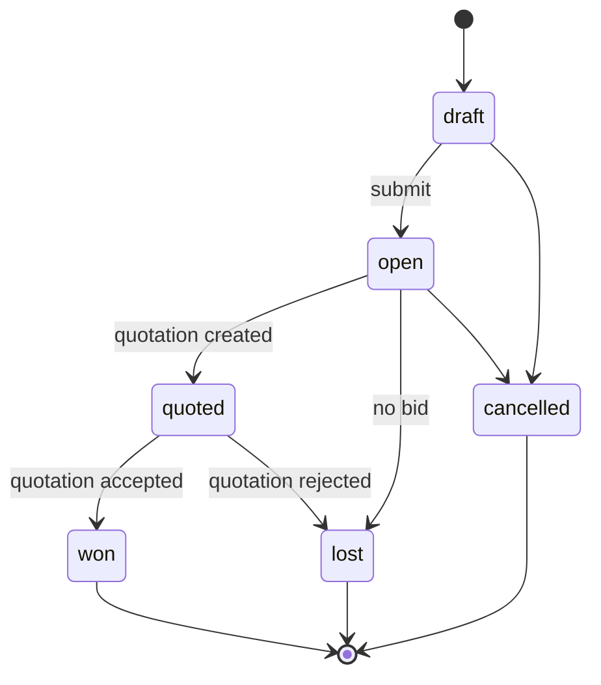

| Transition | Guard | Effect |
|---|---|---|
| draft → open | ≥ 1 line | Assign number (BR-34), set merchandiser |
| open → quoted | A quotation exists | — |
| quoted → won | Quotation `accepted` | — |
| → lost | `lost_reason` present | Feeds win/loss analysis |

### Traceability, in both directions

An inquiry detail page shows the quotations raised against it **and the sales orders those
became**, so a won inquiry names the order it was won with rather than stopping at the quote.
One quotation may hold more than one order over its life — Q5 lets a cancelled order be
re-raised — so this is a list, not a field.

`quotation_lines.inquiry_line_id` records which inquiry line each quotation line answers.
**Quoting a different quantity from the one inquired is legitimate and is not blocked**: a
customer asks for a sample volume and is quoted at the minimum order quantity, or at the annual
programme the tooling is amortised over. The column exists so the change can be *seen* — the
quotation shows what was originally asked for beside what was quoted — not so it can be
prevented. The inquiry's own lines are never rewritten to make the two documents agree.

The column is nullable: a quotation may be raised cold, a line may be added that the customer
never asked for, and quotations raised before the column existed have no recorded pairing.
Those fall back to a document-level comparison, which is all that can honestly be said.

---

## 2. Quotation

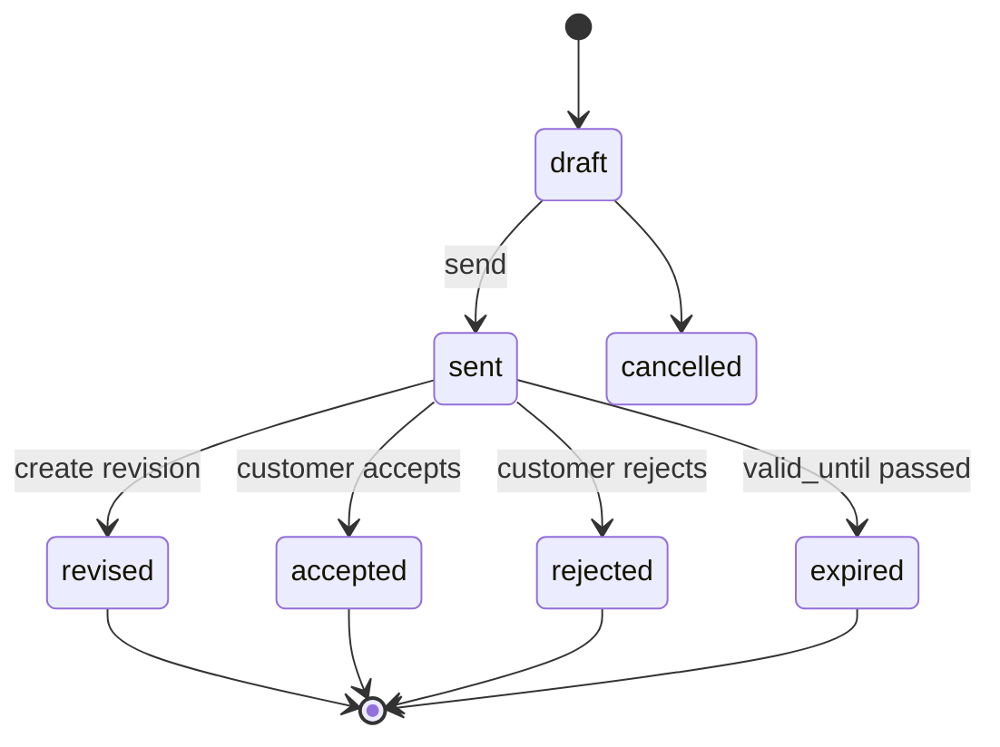

| Transition | Guard | Effect |
|---|---|---|
| draft → sent | Every line has rate > 0 and a cost sheet | Assign number; **snapshot** rates, overheads, margin, exchange rate (Q1); lock cost sheets; generate and attach PDF; stamp `sent_at` |
| sent → accepted | — | Stamp `decided_at`; enable conversion to SO (Q3) |
| sent → rejected | `reject_reason` present | Update inquiry to `lost` if no other open quotation |
| sent → revised | — | Create revision `n+1` copying lines and sheets (Q4); prior becomes read-only |
| sent → expired | `valid_until < today` | Nightly job; may be reopened by revising |

A `sent` quotation is immutable. There is no edit path.

---

## 3. Sales Order

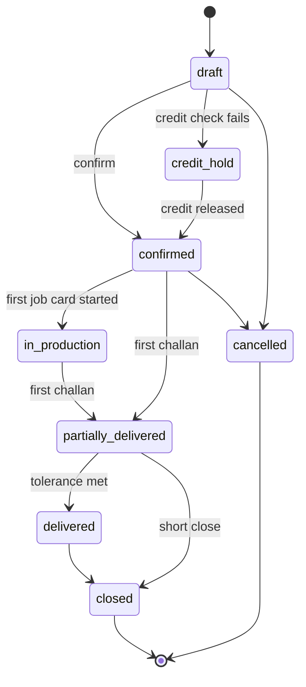

| Transition | Guard | Effect |
|---|---|---|
| draft → confirmed | Every line: `current` spec **and** `approved` artwork (S3) | Assign number; compute `promised_date` (BR-29); reserve nothing yet; emit `SalesOrderConfirmed` |
| draft → credit_hold | `outstanding + value > credit_limit` (BR-46) | Notify Accounts and MD |
| credit_hold → confirmed | Permission `sales_order.release_credit_hold` + reason | Audit-logged release |
| → in_production | A job card started | — |
| → partially_delivered | A challan delivered | Update `delivered_qty` |
| → delivered | `delivered ≥ ordered × (1 − under_tolerance)` (BR-45) | — |
| → closed | Auto on delivered, or manual short-close with reason | Release reservations; final invoice check |
| → cancelled | No produced quantity, or MD approval | Cancel open job cards; release reservations |

Any quantity or date change after `confirmed` writes an `so_amendments` row (S2).

---

## 4. Artwork Version

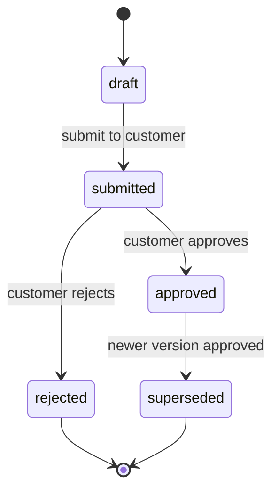

| Transition | Guard | Effect |
|---|---|---|
| draft → submitted | File uploaded with checksum | Generate submission PDF; stamp `submitted_at`; add to follow-up list |
| submitted → approved | `customer_ref` present (evidence required) | Supersede the previous approved version **in the same transaction** (A2); stamp `approved_at`, `approved_by`; emit `ArtworkVersionApproved` |
| submitted → rejected | `rejection_reason` present | Copy reason into the comment thread; design rework queue |

The unique key `artwork_versions_one_approved_uq` — over the generated column `approved_key`, which is NULL unless the version is approved — makes a double-approval physically impossible.

---

## 5. Sample Request

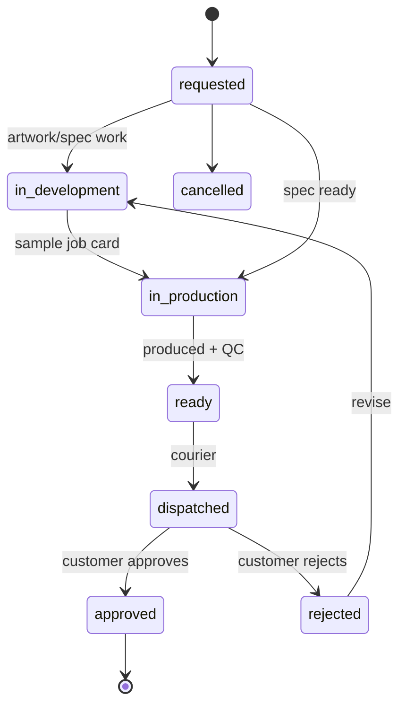

| Transition | Guard | Effect |
|---|---|---|
| → in_production | Spec exists; artwork at least `submitted` | Create sample job card (`job_cards.sample_request_line_id`) |
| → ready | Sample job card completed and QC passed | — |
| → dispatched | Courier and tracking captured | Notify merchandiser; start ageing clock |
| → approved | Decision recorded per line | Unblock bulk production where a pre-production sample is required |
| → rejected | Comment required | Return to development |

---

## 6. Job Card

The most guarded transition in the system.

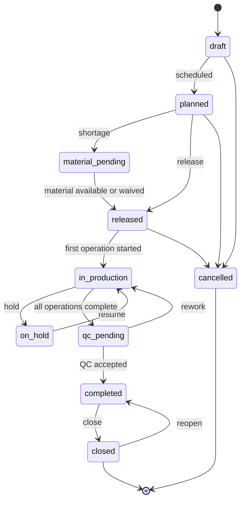

| Transition | Guard | Effect |
|---|---|---|
| draft → planned | Operations scheduled on compatible machines | Snapshot consumption plan (`gross_metres`, `ends`, `labels_per_metre`) |
| planned → released | **All four of J1**: artwork `approved` · BOM `active` · required tools available · material in stock or waived with reason + permission | Reserve stock; first operation → `ready`; appears on shop-floor queue |
| released → in_production | An operation started | Stamp `actual_start`; set the sales order to `in_production` |
| in_production → on_hold | `hold_reason` present | Free the machine slot on the planning board |
| in_production → qc_pending | All operations `completed` or `skipped` (J2 order respected) | Create the final QC inspection |
| qc_pending → in_production | QC disposition = `rework` | Reopen the named operation |
| qc_pending → completed | QC `accepted` or `accepted_with_concession` | Enable FG receipt |
| completed → closed | No open operations, no unresolved QC (J4); produced ≤ planned × (1 + overrun) (J5); **all output received into FG, or a reason plus `job_card.waive_material`** (P0-3) | Release reservations; compute actual cost (BR-23); prompt to return unused material |
| closed → completed | `reopen_reason` present; permission `job_card.close` (P0-3) | Clear `closed_at`; `actual_finish` is **not** re-stamped |
| → cancelled | No production logged, or supervisor approval | Release reservations; return issued material |

### Why `closed` is not quite terminal

Finished goods can only be received from a card that is `in_production`, `qc_pending` or
`completed`. A card closed with output still unreceived therefore stranded it: the pieces
recorded on the job, nothing in stock, and — because BR-49 counts a closed card's planned
quantity as committed against the order line — no headroom left to raise a replacement card
either. The order could not be shipped and the application offered no way out.

Two changes, together: the close now refuses unreceived output unless someone signs for it,
and `closed → completed` exists so a card closed in error is recoverable. Reopening does not
re-ask the QC or material conditions — the card passed them on its way to `completed` and
being closed cannot have undone that — it asks who and why.

---

## 7. Purchase Order

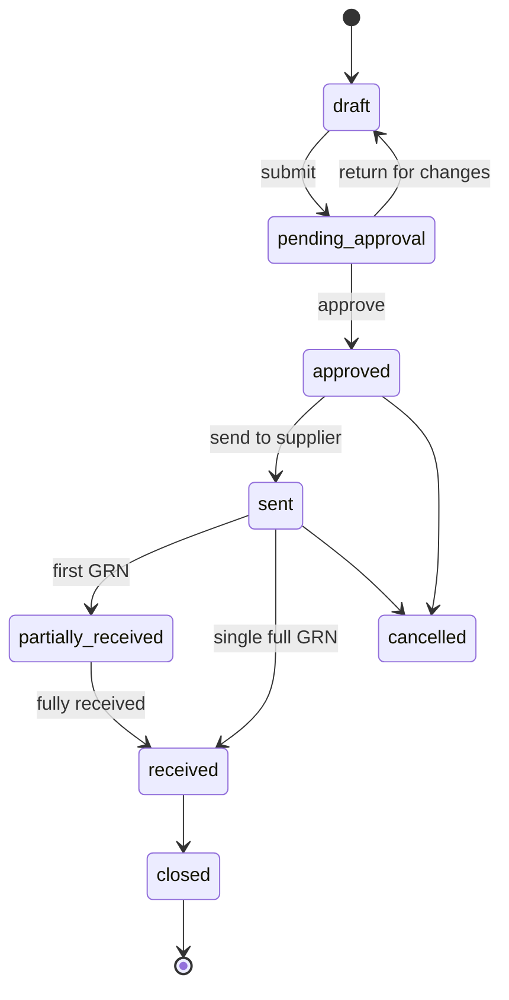

| Transition | Guard | Effect |
|---|---|---|
| draft → pending_approval | Supplier `is_approved`; ≥ 1 line; quantities rounded per BR-25 | Route by value band |
| pending_approval → approved | Approver's band covers the value; ≥ 3 quotations above threshold or override reason | Stamp `approved_by`, `approved_at`; PO becomes read-only |
| approved → sent | — | Generate PDF; email supplier |
| → partially/received | GRN posted | Update `received_qty` per line |
| → closed | Fully received/billed, or manual close with reason | Remove from open-PO reports |
| closed → sent | `reopen_reason` present; permission `purchase_order.close` | Reopen for receipt. Line quantities are untouched by closing, so the next posted GRN rolls the status back up to `partially_received`/`received`. The supplier is not re-notified |

Closing early is deliberate — "stop expecting the balance" — and it used to be irreversible.
A goods receipt is offered only for `approved`, `sent` and `partially_received`, so a balance
delivered after a close could not be booked in at all, by any route.

Changes to an approved PO create revision `n+1` with a reason.

---

## 8. GRN

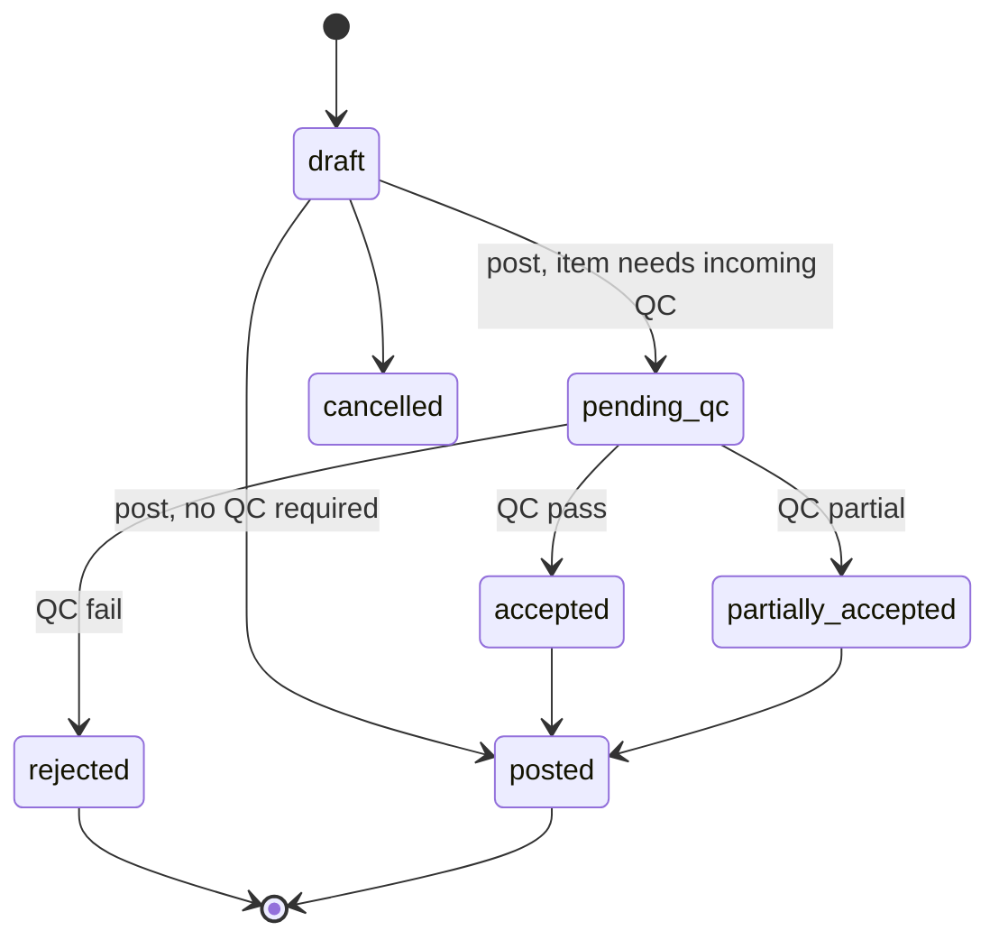

| Transition | Guard | Effect |
|---|---|---|
| draft → posted / pending_qc | Quantities ≤ PO outstanding + tolerance; certification fields present when the PO line declares a claim | Create lots; write `grn_receipt` ledger rows; apportion landed cost (BR-36); update weighted average; write CoC `input` transaction (BR-42) |
| pending_qc → accepted | Inspection recorded | Lots move quarantine → available |
| pending_qc → rejected | Disposition recorded (BR-33) | Draft NCR against supplier; update supplier rating |

---

## 9. QC Inspection

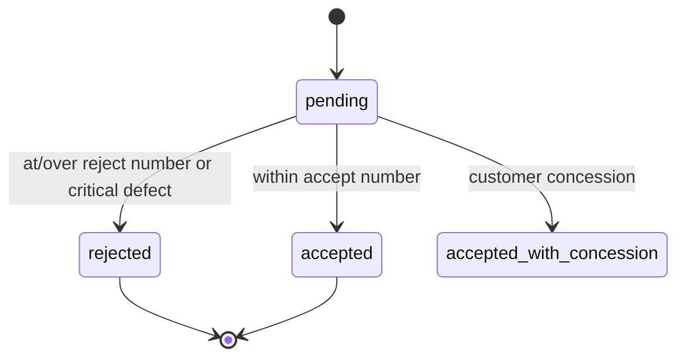

The verdict is **computed** from the AQL plan (BR-30), never typed. The inspector chooses only the disposition, which is mandatory on rejection (DB-enforced, BR-33).

---

## 10. Packing List → Delivery Challan → Trip

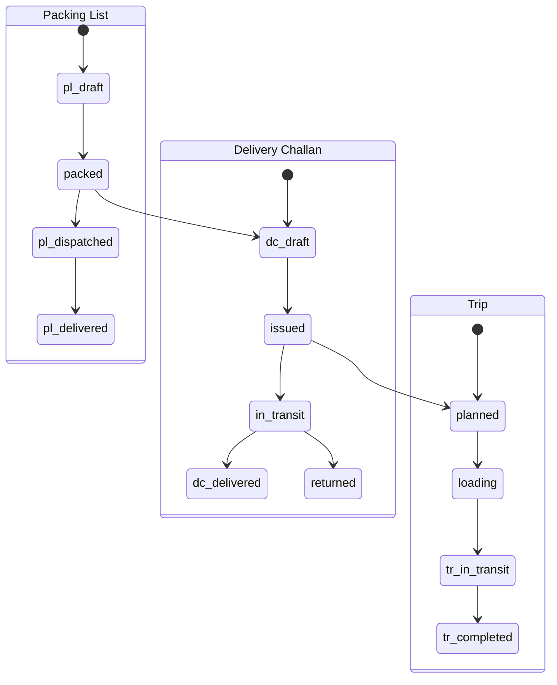

| Transition | Guard | Effect |
|---|---|---|
| PL draft → packed | ≥ 1 carton; all lots passed final QC (D1) | Compute totals; validate certification claim (BR-40, BR-41) |
| DC draft → issued | Packing list `packed` (D3); quantity within delivery tolerance (BR-44) or override; certificate valid on challan date (BR-43) | Assign number; post `dispatch` ledger movement; increment `delivered_qty`; write CoC `output` transaction |
| DC → in_transit | Assigned to a started trip, or handed to courier | — |
| DC → delivered | Consignee complete (D4, re-checked); POD captured (per customer policy) | Update delivery schedule; may auto-close the order line (BR-45) |

**D4 is checked at issue *and* at delivery.** Guarding only `draft → issued` let
`issued → delivered` and `in_transit → delivered` past it entirely, and an address removed from
the order after issue would never be noticed again. Two challans in the live database are
`delivered` with no delivery address at all; they are dispatch history with stock movements
behind them, so they are explained on screen as a historical exception rather than rewritten.
No challan can reach `delivered` without a consignee today.
Tests: `tests/Feature/Dispatch/DeliveryConsigneeAtDeliveryTest.php`.
| DC → returned | Failure reason recorded | Reverse the dispatch movement; return stock |

---

## 11. Sales Invoice

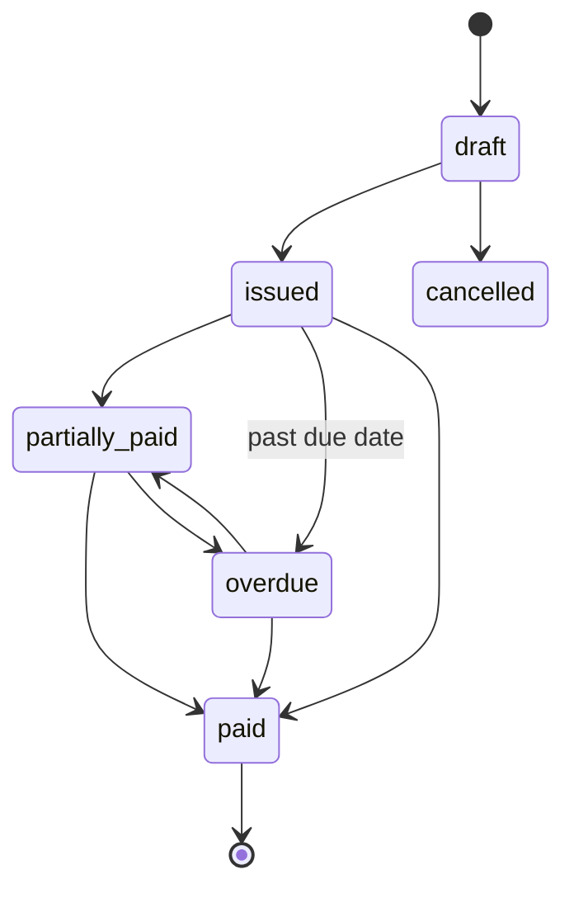

Issued invoices are immutable; corrections are credit notes. `overdue` is set by a nightly job when `due_date < today` and the balance is outstanding.

---

---

## 11a. Sales Return → Credit Note → Application / Refund

A customer takes delivery, is invoiced, pays — and later sends some of it back.

Until this existed the application could not record that at all. Two states are terminal and
both stood in the way: `delivery_challans.delivered`, so the existing challan return could not
be reached, and `sales_invoices.paid`, so the credit note that should answer the goods had
nothing to attach to. The goods came back and the books could not say so.

### Which return is which

| | `delivery_challans → returned` | `sales_returns` |
|---|---|---|
| What happened | The consignment was refused at the gate or turned back in transit | The customer took delivery and later sent goods back |
| Reachable from | `issued`, `in_transit` | Any invoice that billed something, **including `paid`** |
| Scope | The whole challan | Per invoice line, partial, repeatable |
| `delivered_qty` | Decremented — it never really arrived | Untouched — it did arrive |
| Stock | Dispatch entries **reversed** | A new `sales_return` movement posted forward |
| CoC output | Deleted | Reduced in proportion to what came back |

Both still exist and neither is going away. They are different events.

### Rejected, cancelled, returned

**Rejected** is QC's verdict on goods that never left. **Cancelled** is a document that should
not exist, keeping its number (05-workflows §13). **Returned** is goods that left, were
invoiced, and came back — the only one of the three that produces a credit.

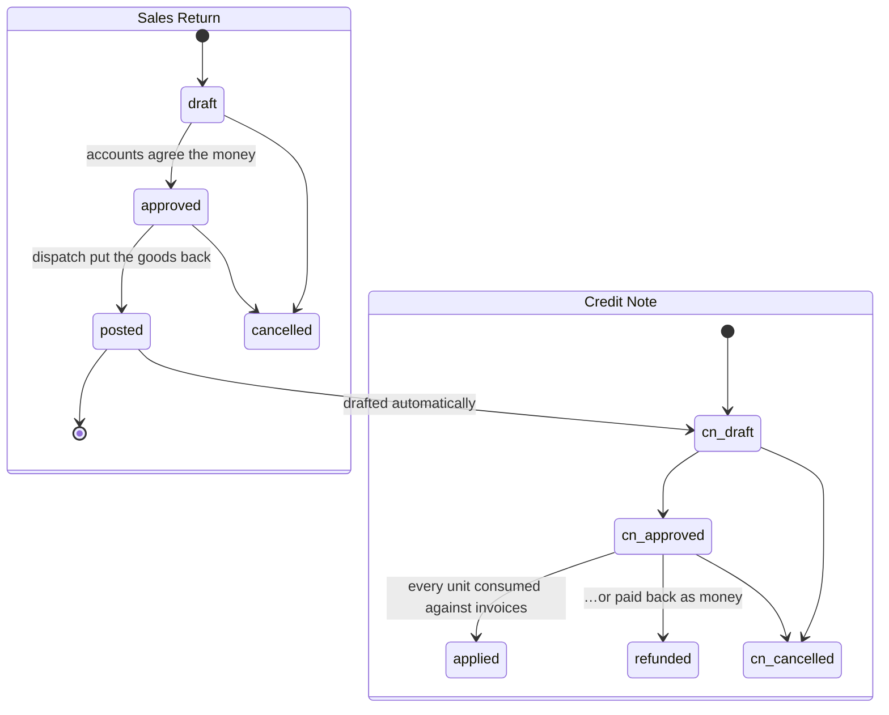

| Transition | Guard | Effect |
|---|---|---|
| draft → approved | SR-1 invoice billed something and is not cancelled · SR-2 customer matches · SR-3 qty ≤ invoiced − already returned, per line · SR-4 line belongs to this invoice | Assign number (BR-34); stamp `approved_by` |
| approved → posted | All of the above **re-derived under a row lock** · SR-5 every line names a lot that was dispatched on this invoice's challan | Increment `sales_invoice_lines.returned_qty`; post `sales_return` stock into the original lot at its own cost, into quarantine; reduce CoC output proportionally; **draft a credit note** |
| → cancelled | — | Nothing was posted, so nothing unwinds. The quantity was never consumed |

`posted` is terminal: the ledger is append-only (I1), and a mistake is corrected by a stock
adjustment, never by unposting.

### Provenance is not application

The distinction the whole design turns on:

```
credit_notes.sales_invoice_id             → where did this credit come from
credit_note_applications.sales_invoice_id → where was it consumed
```

`appliedCredits()` reads the second. It used to read the first, which was correct only while a
credit could reduce nothing but the invoice it named. A return credit names the invoice the
goods were billed on — often a paid one — so reading the old way would have counted it against
an invoice with zero outstanding and driven `total = received + credited + outstanding`
negative.

**The paid invoice is never touched.** Not its status, not `received_amount`, not a single
receipt allocation. `outstanding()` on it stays exactly 0.

### Customer credit

Derived, never stored. Available credit is `approved notes − applications − refunds`, and it
nets against BR-46 exposure because credit the customer holds is the business owing them.
Spent credit is deliberately excluded: an applied note has already reduced an invoice balance
and a refunded one has left the bank, so counting it here as well would relieve the same
exposure twice.

### Inventory

Returned goods post **forward** into the lot they shipped on, at that lot's own `unit_cost` —
a return is not a purchase and must not move the weighted average (BR-36 is for inbound
purchase cost). They land in `quarantine`, the same convention `FgReceiptService` applies to
output with no accepted inspection behind it, so BR-37's lot suggestion will not offer them to
the next job or packing list until somebody has looked at them.

### Approvals

Dispatch receive the goods; accounts agree the money. `sales_return.post` and
`sales_return.approve` are separate rights held by different roles, because a return the people
receiving it can also approve is a return nobody signed for.

---

## 12. NCR / CAPA

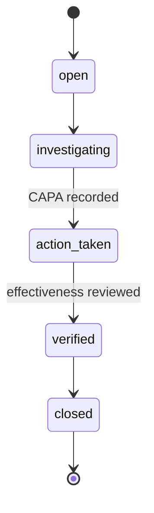

An NCR cannot reach `verified` without at least one CAPA with a root cause, a completed action, and a recorded effectiveness review.

---

## 13. Cross-cutting rules

| Rule | Detail |
|---|---|
| **Numbering** | Assigned on the first transition out of `draft`, never on form open (BR-34) |
| **Cancellation** | Cancelled documents keep their number and status; they are never deleted |
| **Audit** | Every transition writes an `audit_logs` row with old/new status, user, timestamp, IP |
| **Atomicity** | Guard check, status change, side effects and audit row are one database transaction |
| **Idempotence** | Transitioning to the current status is a no-op, not an error — protects against double-submit on flaky shop-floor wifi |
| **Permissions** | Every transition maps to a permission (`<document>.<transition>`) — see [06-rbac](06-rbac.md) |
| **Events** | Transitions with downstream consequences dispatch a domain event; listeners are queued |
